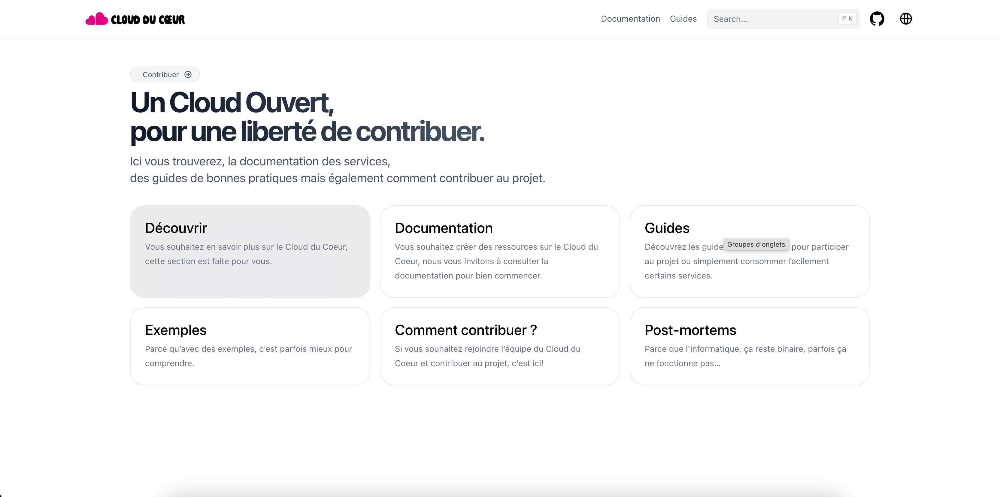

# Documentation publique – Cloud du Cœur

Ce dépôt contient la documentation publique du Cloud du Cœur, générée avec [Hugo](https://gohugo.io/) et le thème [Hextra](https://github.com/imfing/hextra).

## Aperçu

- **Générateur de site statique** : [Hugo](https://gohugo.io/)
- **Thème** : [Hextra](https://github.com/imfing/hextra)
- **Contenus** : Documentation, guides, FAQ, etc.

## Structure du projet

- `content/` : Contenus principaux (documentation, guides…)
- `archetypes/` : Modèles de contenu Hugo
- `assets/` : Fichiers statiques (CSS, images…)
- `layouts/` : Templates personnalisés
- `static/` : Fichiers statiques servis tels quels
- `themes/` : Thèmes Hugo (Hextra)
- `hugo.yaml` : Configuration principale du site
