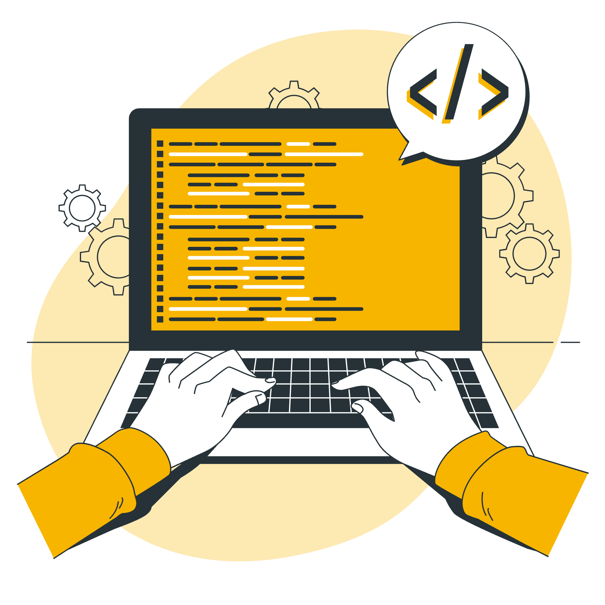

Cette documentation concerne l'installation de la ligne de commande OpenStack, OpenStack étant le logiciel utilisé pour faire tourner le Cloud du Coeur.



## L'installer

En fonction du système d'exploitation sur lequel vous êtes, vous trouver la documentation d'installation associée.




Sur **macOS**, pour installer la CLI `openstack`, vous devez utiliser le gestionnaire de paquets **Homebrew**.

Pour installer la CLI :

```bash
brew install openstackclient
```





## S'authentifier

Une fois que la CLI est installée, vous devez configurer la CLI en fonction de votre système d'exploitation pour pouvoir vous connecter à la plateforme du *Cloud du Coeur*.




Il faudra se connecter dans l'interface (console) et récupérer votre fichier `.keystonerc`. Ce fichier sera à ajouter dans `$HOME/.keystonerc`.

Une fois que c'est fait, pour utiliser la CLI et connecter cette dernière à la plateforme du *Cloud du Coeur*, il faut charger les informations :

```bash
source $HOME/.keystonerc
```




