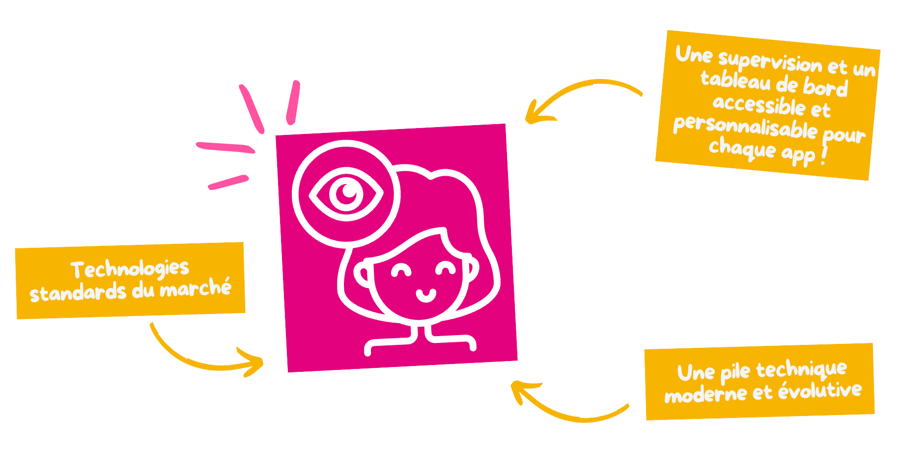

## Pour bien commencer


  


## Qu'est-ce que c'est ?

### L'observabilité au coeur du projet

L'observabilité est au coeur du projet du Cloud du Coeur pour plusieurs raisons :

- **Assurer la fiabilité** : Elle permet de surveiller en temps réel l’état des services pour garantir leur bon fonctionnement et réagir rapidement en cas de problème.
- **Anticiper les incidents** : Grâce à la collecte d’indicateurs, il est possible de détecter des anomalies ou des tendances avant qu’elles ne deviennent des incidents majeurs.
- **Améliorer la qualité de service** : En comprenant comment les services sont utilisés et en identifiant les points d’amélioration, on peut offrir une expérience plus fluide aux utilisateurs.
- **Transparence** : Les tableaux de bord (par exemple avec **Grafana**) offrent une vision claire et accessible de l’état du système, pour tous les membres de l’équipe.
- **Prise de décision** : Les données collectées aident à prendre des décisions éclairées pour l’évolution de la plateforme.

Pour cela, nous utilisons des outils comme **VictoriaMetrics** (pour la collecte et l’analyse des métriques) et **Grafana** (pour la visualisation et le suivi via des tableaux de bord).

Les données d'observabilité sont stockées dans la région **Chartres | CHA** du Cloud du Coeur.

## Demander un tenant

Chaque nouveau projet doit disposer de son propre tenant VictoriaMetrics. Avant
d'utiliser les endpoints de lecture ou d'écriture, créez un ticket dans
[Tickoeur](https://tickoeur.restosducoeur.org/) à destination de l'équipe du
Cloud du Coeur afin qu'elle crée un tenant associé au projet.

## L'utiliser


  
  

