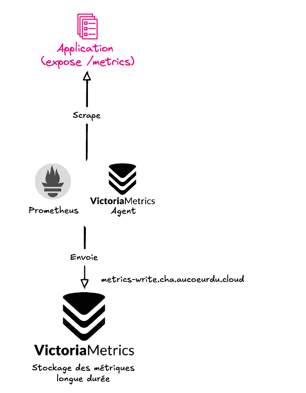

## Endpoint d'écriture

Voici le schéma qui résume le fonctionnement de l'endpoint d'écriture et le flux des métriques vers votre tenant.



Envoyez les métriques de votre projet via l'adresse suivante :

```text
https://metrics-write.cha.aucoeurdu.cloud
```

Chaque nouveau projet génère un tenant spécifique. L'endpoint complet
VictoriaMetrics Remote Write est construit avec cet identifiant :

```text
https://metrics-write.cha.aucoeurdu.cloud/insert/<tenant>/prometheus/api/v1/write
```

Configurez cette URL dans l'agent qui collecte vos métriques, par exemple :

```yaml
remote_write:
	- url: https://metrics-write.cha.aucoeurdu.cloud/insert/<tenant>/prometheus/api/v1/write
```

Remplacez `<tenant>` par l'identifiant de votre projet. Les métriques sont
ainsi écrites dans l'espace qui lui est réservé.
