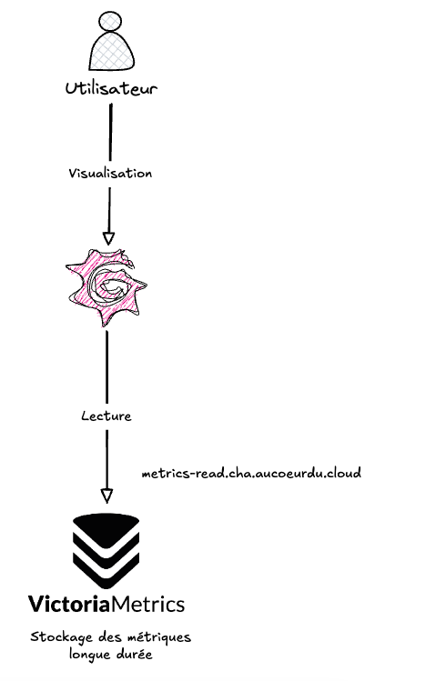

## Endpoint de lecture

Voici le schéma qui résume le fonctionnement de l'endpoint de lecture et le flux des métriques vers votre tenant.



Les métriques sont consultables via l'adresse suivante :

```text
https://metrics-read.cha.aucoeurdu.cloud
```

Chaque projet dispose de son propre tenant. Remplacez `<tenant>` par
l'identifiant associé à votre projet :

```text
https://metrics-read.cha.aucoeurdu.cloud/select/<tenant>/prometheus/api/v1/query
```

Pour exécuter une requête PromQL, utilisez par exemple l'API HTTP de
VictoriaMetrics :

```bash
curl --get \
	'https://metrics-read.cha.aucoeurdu.cloud/select/<tenant>/prometheus/api/v1/query' \
	-u '<username>:<password>' \
	--data-urlencode 'query=up'
```

Le tenant isole les métriques du projet. Une requête ne peut donc consulter
que les données du tenant utilisé dans l'URL.

A noter que le nom d'utilisateur et le mot de passe vous sera communiqué lors de la création du tenant. Pensez à bien le conserver. Dans le cas d'une perte de ce dernier, n'hésitez pas à nous contacter via un ticket support.
