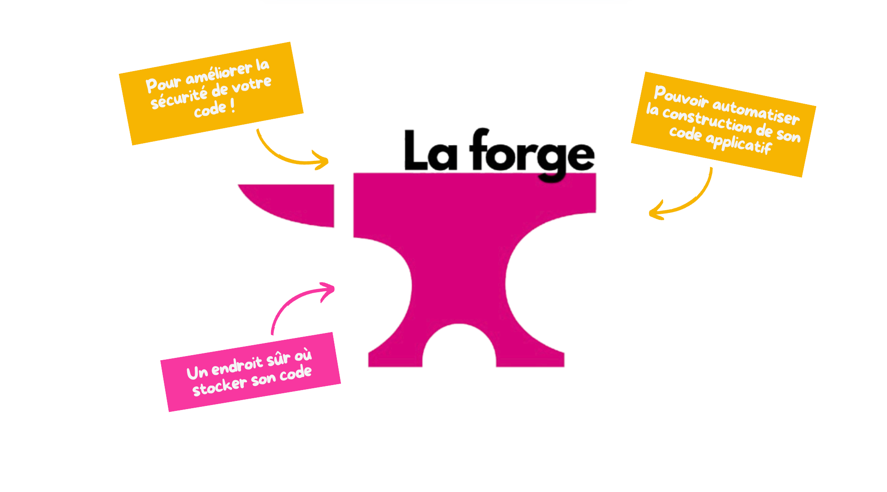

La forge représente l'infrastructure centrale de développement des Restos du Cœur. Basée sur [GitLab](https://about.gitlab.com/) et [GitLab CI](https://about.gitlab.com/), elle constitue notre plateforme unifiée pour le stockage, la collaboration et l'intégration continue de tous nos projets logiciels.

## Qu'est-ce que la forge ?

Notre forge est *une instance GitLab dédiée* qui nous offre un environnement complet de développement logiciel. 

Elle combine plusieurs fonctionnalités essentielles : la gestion de versions avec Git, l'intégration continue et le déploiement automatisé (CI/CD), la gestion des projets et la collaboration entre équipes.


  


Cette infrastructure nous permet de centraliser tous nos développements au sein d'une plateforme que *nous maîtrisons entièrement*. Contrairement aux services publics comme GitHub, notre forge nous **garantit un contrôle total sur nos données et nos processus de développement**.

## Une approche sécurisée et maîtrisée

L'un des principaux avantages de notre forge interne réside dans le contrôle de la **sécurité** et de la **confidentialité**. Tous nos projets, qu'ils soient destinés à être *partagés publiquement ou non*, transitent par cette infrastructure sécurisée avant toute publication éventuelle.

Cette approche nous évite d'exposer involontairement du code sensible sur des plateformes publiques. Les informations de configuration, les clés d'API de développement, ou les détails d'architecture interne restent protégés dans notre environnement contrôlé. Nous pouvons ainsi développer sereinement sans risquer de compromettre la sécurité de nos systèmes.

La forge nous permet également de gérer finement les accès selon les profils des contributeurs. Les développeurs internes, les bénévoles techniques et les partenaires externes peuvent avoir des niveaux d'accès adaptés à leur rôle et leur niveau d'engagement.

## Intégration continue et qualité du code

GitLab CI, intégré à notre forge, automatise l'ensemble du cycle de vie de nos applications. Chaque modification de code déclenche automatiquement une série de vérifications : tests unitaires, analyse de code, vérification de sécurité et construction des artefacts.

Cette automatisation nous garantit un niveau de qualité constant et réduit considérablement les risques d'introduction de bugs ou de vulnérabilités. Les développeurs reçoivent un retour immédiat sur leurs modifications, ce qui accélère le processus de développement tout en maintenant la stabilité.

Les pipelines CI/CD nous permettent également de déployer automatiquement nos applications sur différents environnements de test et de production, réduisant les erreurs humaines et garantissant la reproductibilité des déploiements.

## Collaboration et gestion de projet

Au-delà du code, la forge sert de hub central pour la coordination de nos projets techniques. Les issues permettent de tracker les bugs et les demandes d'évolution, les merge requests facilitent la revue de code collaborative, et les wikis centralisent la documentation technique.

Cette approche unifiée évite la dispersion des informations entre différents outils et facilite l'onboarding des nouveaux contributeurs. Un développeur peut accéder à l'ensemble du contexte d'un projet depuis une interface unique : code, documentation, historique des décisions et roadmap.

## Flexibilité entre privé et public

Notre forge nous offre la flexibilité de choisir le niveau de visibilité approprié pour chaque projet. Nous pouvons développer en privé puis décider du moment opportun pour rendre un projet public, soit sur notre forge soit en le publiant sur des plateformes externes comme GitHub.

Cette approche en deux temps nous permet de mûrir nos projets, de nettoyer l'historique si nécessaire, et de préparer une documentation adaptée au public visé avant toute publication. Nous gardons ainsi le contrôle sur notre communication technique et notre image.

## Infrastructure technique

Notre forge repose sur une infrastructure maîtrisée qui s'intègre parfaitement dans notre écosystème technique. Elle bénéficie des mêmes standards de sécurité, de sauvegarde et de monitoring que nos autres services critiques.

Cette intégration nous permet de mettre en place des workflows de déploiement qui s'appuient directement sur notre infrastructure Cloud du Cœur, créant une chaîne complète de la conception à la production.

La forge constitue ainsi un maillon essentiel de notre autonomie technologique, nous permettant de développer et déployer nos solutions de manière indépendante et sécurisée.
