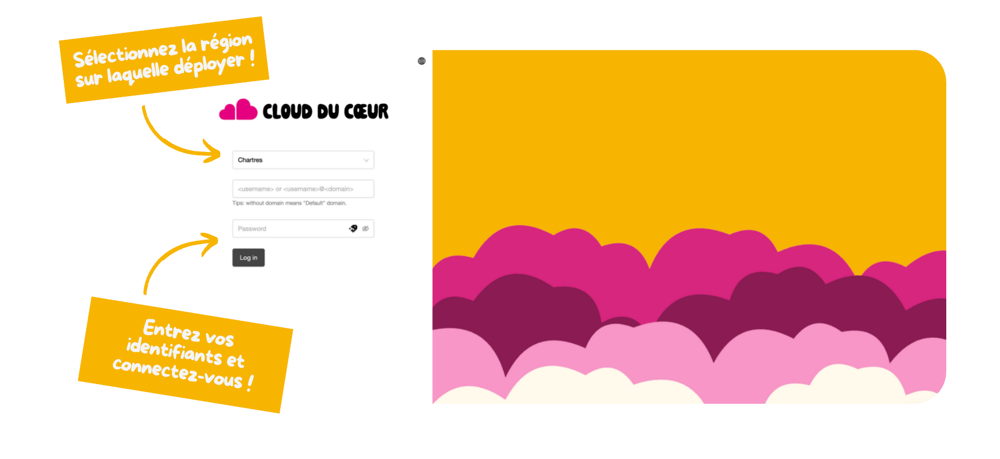

Vous souhaitez utiliser la plateforme du Cloud du Coeur, suivez cette documentation pour bien commencer.

{}

### Obtenir un accès

Pour commencer, vous devez avoir un compte `@restosducoeur.org` pour accéder aux différents services.

Le SSO est actif sur les différents produits mis à disposition (la console, la plateforme d'observabilité, etc).


  Si vous rencontrez un souci pour vous connecter, veuillez lire [cette documentation](/doc/aide/).


### Se connecter à la console

Une fois que vous avez obtenu vos accès, vous allez pouvoir accéder à la console du Cloud du Coeur et vous authentifier via SSO.

Pour vous connecter, vous devez aller sur :

- [https://console.aucoeurdu.cloud](https://console.aucoeurdu.cloud)

### Créer sa première instance

{}
flowchart LR

User( Utilisateur ) --> VM

subgraph Cloud[Cloud du Coeur]
  VM( Créer une VM )
  Net( Connecter à un réseau )
  IP( Assigner une IP publique )

  VM --> Net
  Net --> IP
end

IP --> Ready( L'instance est prête )

%% Style
classDef main fill:#e5007d,color:#ffffff,stroke:#e5007d
classDef step fill:#1396db,stroke:#1396db,color:#fff
classDef cloud fill:#D4D4D4,stroke:#D4D4D4,stroke-width:2px

class VM,Net,IP main
class User,Ready step
class Cloud cloud

%% Animation des flèches
linkStyle default stroke-dasharray: 9,5,stroke-dashoffset: 900,animation: dash 25s linear infinite;
{}

{}
