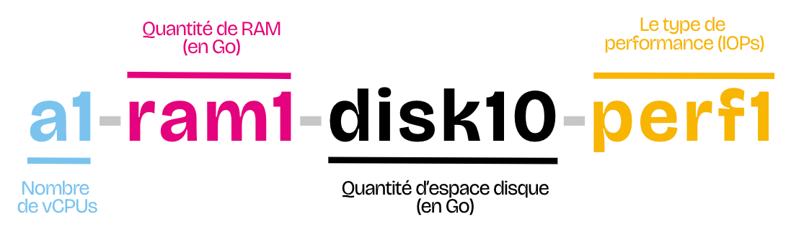

Les **gabarits** (flavors) définissent les ressources allouées à une instance : nombre de vCPU, quantité de RAM, taille du disque et niveau de performance disque.

## Convention de nommage

Le nom d'un gabarit suit le format :

- **a** : nombre de vCPU
- **ram** : quantité de RAM en Go
- **disk** : taille du disque en Go
- **perf** : niveau de performance I/O disque (1 = standard, 4 = NVMe haute performance)

## Les tailles

### Nano workloads

| Flavor | vCPU | RAM | Disk | Perf |
|--------|------|-----|------|------|
| a1-ram1-disk10-perf1 | 1 | 1 GB | 10 GB | perf1 |
| a1-ram2-disk10-perf1 | 1 | 2 GB | 10 GB | perf1 |

### Petits workloads

| Flavor | vCPU | RAM | Disk | Perf |
|--------|------|-----|------|------|
| a2-ram4-disk20-perf1 | 2 | 4 GB | 20 GB | perf1 |
| a2-ram4-disk20-perf2 | 2 | 4 GB | 20 GB | perf2 |
| a2-ram8-disk40-perf1 | 2 | 8 GB | 40 GB | perf1 |
| a2-ram8-disk40-perf2 | 2 | 8 GB | 40 GB | perf2 |

### Workloads intermédiaires

| Flavor | vCPU | RAM | Disk | Perf |
|--------|------|-----|------|------|
| a4-ram8-disk40-perf1 | 4 | 8 GB | 40 GB | perf1 |
| a4-ram8-disk40-perf2 | 4 | 8 GB | 40 GB | perf2 |
| a4-ram16-disk80-perf1 | 4 | 16 GB | 80 GB | perf1 |
| a4-ram16-disk80-perf2 | 4 | 16 GB | 80 GB | perf2 |

### Workloads intensifs (DB, logs, search)

| Flavor | vCPU | RAM | Disk | Perf |
|--------|------|-----|------|------|
| a8-ram16-disk20-perf1 | 8 | 16 GB | 20 GB | perf1 |
| a8-ram16-disk20-perf2 | 8 | 16 GB | 20 GB | perf2 |
| a8-ram32-disk160-perf2 | 8 | 32 GB | 160 GB | perf2 |
| a8-ram32-disk160-perf3 | 8 | 32 GB | 160 GB | perf3 |

### Haute performance / NVMe

| Flavor | vCPU | RAM | Disk | Perf |
|--------|------|-----|------|------|
| a16-ram64-disk320-perf3 | 16 | 64 GB | 320 GB | perf3 |
| a16-ram64-disk320-perf4 | 16 | 64 GB | 320 GB | perf4 |
| a32-ram128-disk640-perf4 | 32 | 128 GB | 640 GB | perf4 |

{}
Pour lister les gabarits disponibles via la CLI : `openstack flavor list`
{}
