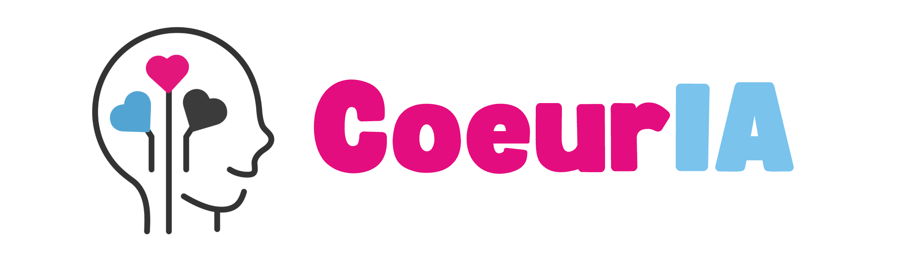

CœurIA est une IA conçue pour et par le monde associatif, avec une ambition simple : **transformer la technologie en un levier concret de solidarité**, en aidant les bénévoles à gagner du temps et à sauver davantage de ressources essentielles.

 

<iframe src="https://player.vimeo.com/video/1206177695?badge=0&amp;autopause=0&amp;player_id=0&amp;app_id=58479&amp;autoplay=1&amp;muted=1&amp;loop=1" frameborder="0" allow="autoplay; fullscreen; picture-in-picture; clipboard-write; encrypted-media; web-share" referrerpolicy="strict-origin-when-cross-origin" style="position:absolute;top:0;left:0;width:100%;height:100%;" title="Cloud du Coeur - Démo CoeurIA - Intégration Slack"></iframe>

CœurIA fournit un ensemble d'outils visant à aider au mieux nos bénévoles dans leurs actions du quotidien. Dans cette documentation, vous retrouverez :

- [Comment fonctionne CœurIA ?](https://doc.aucoeurdu.cloud/doc/solutions/coeuria/comment-ca-marche/)
- [Comment l'utiliser ?](https://doc.aucoeurdu.cloud/doc/solutions/coeuria/bien-commencer/)
- [Comment l'intégrer à d'autres outils ?](https://doc.aucoeurdu.cloud/doc/solutions/coeuria/integrations/)
- [Comment développer avec CœurIA ?](https://doc.aucoeurdu.cloud/doc/solutions/coeuria/developper/)
