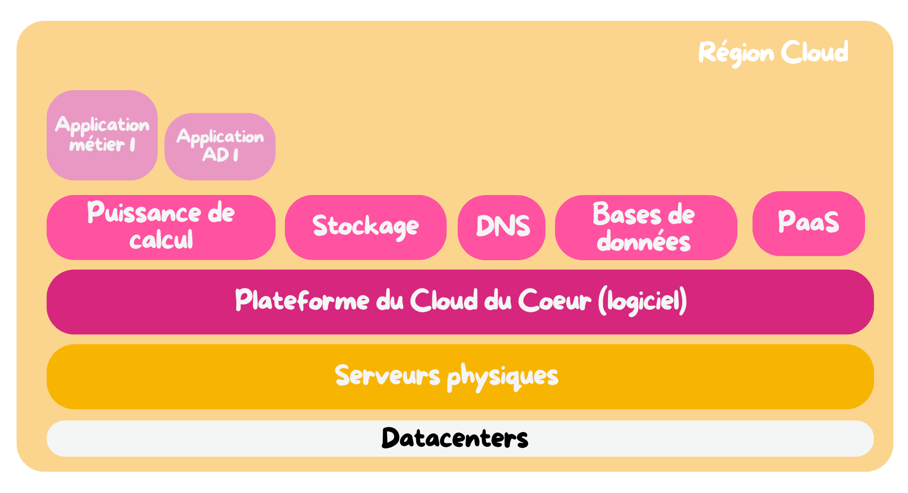

Le *Cloud du Coeur* est parti d'une idée, celle de rendre l'accès à l'infrastructure ***ouverte*** à toute personne technique au sein des [Restos du Coeur](https://www.restosducoeur.org/) dans un but d'**effort concentré**.

Pour les plus novices, le "Cloud du Cœur" est un projet informatique initié par des bénévoles des Restos du Cœur pour construire une infrastructure cloud éthique et la plus économique possible, dédiée à répondre aux besoins technologiques de l’association fiablement.

## Pourquoi ?

L’informatique est devenue vitale pour le fonctionnement des Restos (gestion des bénévoles, des centres, des repas, etc.).

Le cloud public est très coûteux : aux Restos, **1 euro = 1 repas**.

Objectifs :

- Réduire les coûts
- Gagner en autonomie (statégie sur le long terme)
- Mettre les compétences des bénévoles IT au service de la solidarité
- Une infrastructure *répartie*, *redondante* et *résiliente*
- Fournir une base solide pour le futur de l'informatique des Restos

## Les principes fondateurs

- [Éco-conception](/en-savoir-plus/cest-quoi/les-principes-fondamentaux/eco-conception/) (réduction de l'empreinte écologique)
- Indépendance technologique et autonomie stratégique
- Automatisation, transparence, et documentation
- Technologies ouvertes
- Accès facilité aux différents acteurs (bénévoles techs, prestataires, etc)

## Qu’est-ce que c’est concrètement ?

Une infrastructure de cloud privée construite avec :

- Du matériel *donné* par les entreprises (matériel destiné au **recyclage**)
- Des technologies libres et open source (OpenStack, Kubernetes, Ceph…)
- Une approche DevOps/infra as code
- Une gestion communautaire et collaborative (type open source)
