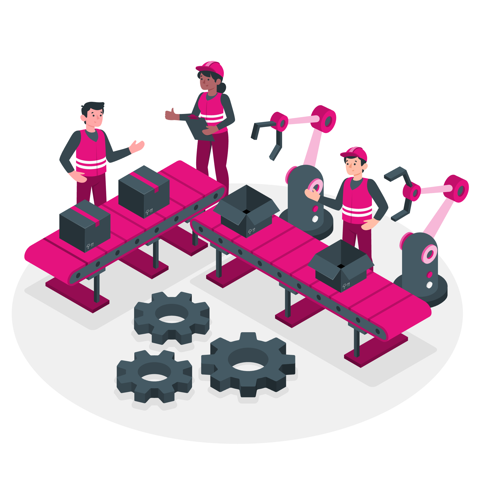

L'**automatisation** est *un principe fondamental* qui nous permet de maximiser l'efficacité de nos ressources humaines et techniques. Dans un contexte associatif où chaque minute compte et où nos bénévoles sont précieux, automatiser les tâches répétitives nous permet de nous concentrer sur l'essentiel.

## Pourquoi automatiser ?

L'automatisation répond à plusieurs enjeux cruciaux dans notre environnement associatif. Elle nous permet d'optimiser notre temps, notre énergie et nos ressources limitées pour mieux servir notre mission sociale avec technique.

### Libérer du temps pour l'humain

Chaque tâche automatisée représente du temps gagné pour nos équipes. Plutôt que de consacrer des heures à des opérations répétitives et parfois fastidieuses, nos bénévoles et salariés peuvent se concentrer sur les aspects relationnels et créatifs de leur mission.

Cette approche nous permet également de réduire le risque d'erreurs humaines sur les tâches routinières, améliorant ainsi la qualité et la fiabilité de nos services.

### Assurer la continuité de service

L'automatisation garantit que certaines opérations critiques continuent de fonctionner même en l'absence de personnel. Les sauvegardes automatiques, la surveillance des systèmes, ou encore la génération de rapports peuvent ainsi s'exécuter 24h/24 et 7j/7.

Cette continuité est particulièrement importante dans un contexte associatif où les équipes peuvent être réduites et où la disponibilité des bénévoles peut varier.

## Nos domaines d'automatisation

Nous appliquons l'automatisation à plusieurs niveaux de notre infrastructure et de nos processus, toujours dans le respect de nos autres principes fondamentaux.

### Infrastructure et déploiement

L'automatisation de notre infrastructure nous permet de déployer rapidement et de manière reproductible nos services. Grâce à des outils d'Infrastructure as Code (IaC), nous pouvons :

- Provisionner automatiquement de nouveaux serveurs (via **MaaS** et **Ansible** par exemple)
- Déployer des applications de manière cohérente
- Appliquer les mises à jour de sécurité automatiquement
- Gérer les configurations de manière centralisée

Cette approche nous garantit des environnements stables et sécurisés, tout en réduisant considérablement le temps nécessaire aux opérations de maintenance.

### Surveillance et alertes

Notre système de surveillance automatisé veille en permanence sur la santé de notre infrastructure. Il nous alerte proactivement en cas de problème, nous permettant d'intervenir rapidement avant que les utilisateurs ne soient impactés.

Les métriques collectées automatiquement nous aident également à optimiser nos ressources et à prévoir les besoins futurs.

### Intégration et livraison continues (CI/CD)

L'automatisation de nos processus de développement nous permet de livrer des améliorations plus rapidement et plus sûrement. Chaque modification de code déclenche automatiquement :

- Des tests pour vérifier la qualité
- Des analyses de sécurité
- Des déploiements sur les environnements appropriés

Cette approche nous permet de maintenir un haut niveau de qualité tout en accélérant notre capacité d'innovation.

### Gestion des données et reporting

L'automatisation de la collecte et du traitement des données nous permet de générer des rapports réguliers sans intervention manuelle. Ces rapports nous aident à :

- Suivre l'utilisation de nos services
- Identifier les tendances et les besoins
- Produire des statistiques pour nos partenaires
- Optimiser nos ressources

## Automatisation éthique et responsable

Notre approche de l'automatisation reste guidée par nos valeurs humanistes. Nous veillons à ce que l'automatisation serve l'humain et non l'inverse.

### Transparence et contrôle

Tous nos processus automatisés sont documentés et auditables. Nous maintenons la possibilité d'intervention manuelle quand nécessaire et nous gardons un contrôle humain sur les décisions importantes.

### Respect de la vie privée

L'automatisation du traitement des données personnelles est conçue dans le respect du RGPD et de nos engagements éthiques. Nous automatisons la protection des données autant que leur traitement.

### Formation et accompagnement

Nous nous assurons que nos équipes comprennent les processus automatisés et peuvent les maintenir. L'automatisation *ne doit pas créer de dépendance technologique paralysante*.

## Outils et technologies

Nous privilégions les outils open source pour nos automatisations, en cohérence avec nos autres principes :

- **Ansible** pour l'automatisation de la configuration
- **GitLab CI/CD** pour l'intégration continue
- **Docker** pour la containerisation
- **Kubernetes** pour l'orchestration
- **Prometheus** et **Grafana** pour la surveillance
- **Terraform** pour l'Infrastructure as Code

Ces outils nous offrent la flexibilité nécessaire pour adapter nos automatisations à nos besoins spécifiques tout en bénéficiant de communautés actives.

## Bénéfices concrets

L'automatisation nous apporte des bénéfices mesurables au quotidien :

- **Réduction des erreurs** : Les processus automatisés sont plus fiables que les interventions manuelles répétitives
- **Gain de temps** : Nos équipes peuvent se concentrer sur des tâches à plus forte valeur ajoutée
- **Amélioration de la sécurité** : Les mises à jour et les sauvegardes automatiques renforcent notre posture sécuritaire
- **Évolutivité** : Nos services peuvent grandir sans augmentation proportionnelle de la charge de travail
- **Cohérence** : Les processus automatisés garantissent des résultats reproductibles

## Conclusion

L'automatisation est un levier puissant pour optimiser notre impact social tout en respectant nos contraintes de ressources. Elle nous permet de faire plus avec moins, libérant nos équipes pour se concentrer sur ce qui compte vraiment : accompagner ceux qui en ont besoin.

Cette approche, combinée à nos autres principes fondamentaux, nous aide à **construire une infrastructure technique durable**, **efficace** et **au service de notre mission**.
