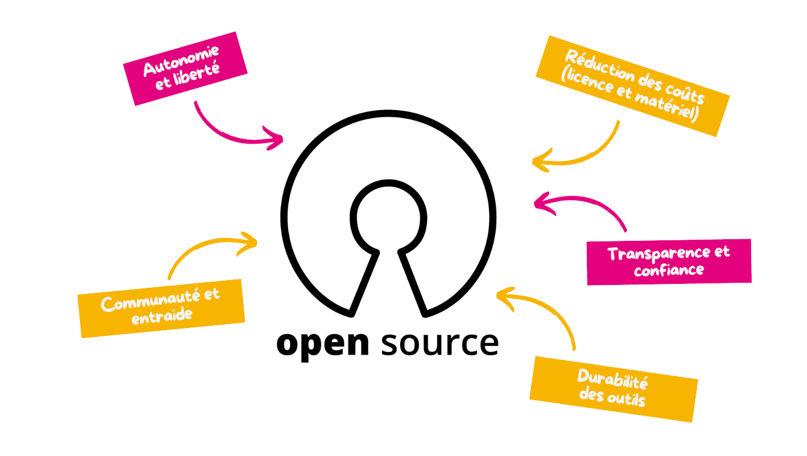

Sous le capot du **Cloud du Coeur** on retrouve une chose essentielle et qui est une base constituant tout ce qui gravite autour de ce dernier : les logiciels **Open Source** voir **libres** quand c'est possible.

Ces logiciels nous permettent d'avoir des impacts positifs pour nos associations (départementales et nationale) mais également pour notre planête.

## La base de tout

Pour nos **associations** :

- **Réduction des coûts** : Les logiciels open source sont souvent gratuits, ce qui permet aux associations de limiter les dépenses en informatique (surtout dans un contexte *1 euro = 1 repas*).
- **Autonomie et liberté** : Pas de dépendance à un fournisseur unique. L’association peut adapter les outils à ses besoins spécifiques.
- **Transparence et confiance** : Le code étant accessible, il est possible de vérifier ce que fait réellement le logiciel (respect de la vie privée, sécurité, etc.).
- **Communauté et entraide** : L’open source s’appuie sur des communautés actives qui offrent du support, des conseils, et parfois même des contributions techniques.
- **Durabilité des outils** : Même si un éditeur ferme, le code reste disponible. Cela permet de maintenir un projet à long terme.

Pour notre **planête** :

- **Allongement de la durée de vie des équipements** : Beaucoup de logiciels open source sont légers et optimisés (exemple : `GNU/Linux`), permettant de faire fonctionner de vieux ordinateurs (ex : Linux), réduisant ainsi les déchets électroniques.
