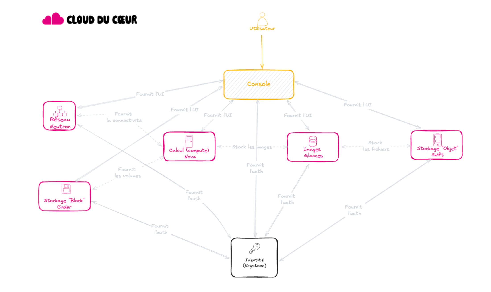

Le Cloud du Coeur utilise une technologie Open Source qui se nomme [OpenStack](https://www.openstack.org/). Cette technologie vise à fournir "*as a service*" différents éléments d'infrastructure nécessitant autrefois, une dépendance à une équipe pour la mise à disposition de ressources d'infrastructure.

