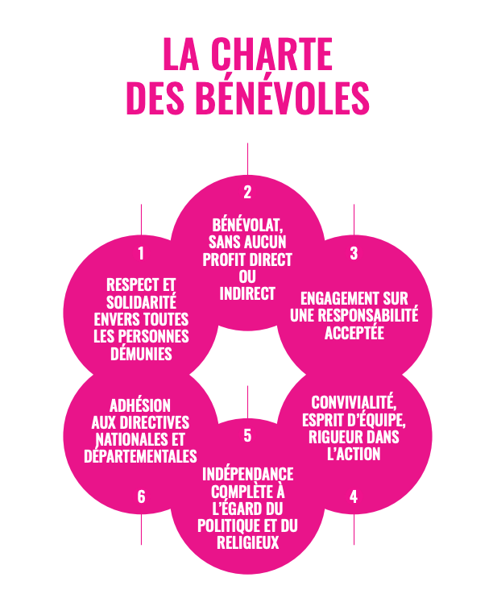

## Les engagements globaux

- **Écoconception** : pas d’achats inutiles, matériel revalorisé.
- **Open Source** : 100 % technologies libres ou Open Source.
- **Accessibilité** : formation et documentation claire pour les bénévoles.
- **Autonomie Stratégique** : nos IPs, notre backbone, notre cloud.

## Les engagements du bénévole

Chaque bénévole participant au projet du **Cloud du Coeur** est tenu de respecter la charte des [Restos du Coeur](https://www.restosducoeur.org/).

