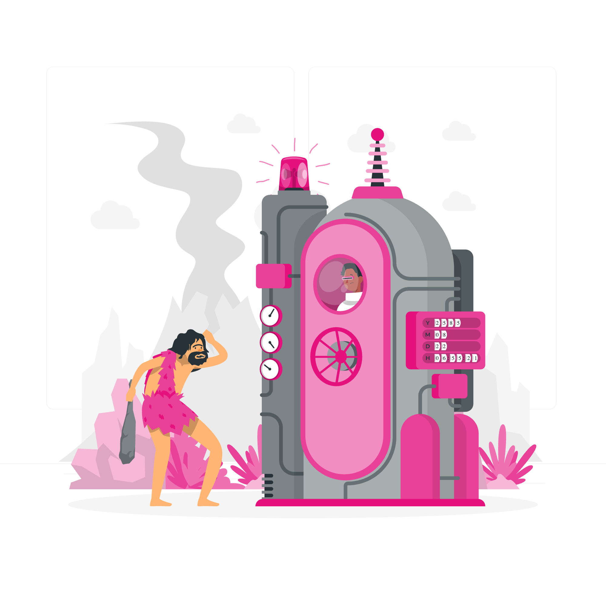

Pour comprendre comment nous en sommes arrivés à créer une plateforme de Cloud dans une association comme les Restos du Coeur, il est important de rappeler l'historique de ce projet.

{}

### Le "pc qui traîne dans un coin"

... et qui était utilisé comme **serveur**.

Dans l'antenne du 28 (Eure et Loir), tout comme dans tout plein d'antennes, celle-ci avait des besoins informatiques divers nécessitant de l'hébergement. Comme la grande majorité, ces services étaient hébergés sur un ordinateur lambda, servant de *serveur*.

Ce PC qui traînait dans un coin possèdait tout un lot de problèmes :

- Pas de sauvegardes
- Aucune redondance
- Pas de surveillance
- Documentation absente

### Le DC aux WC

...

{}
