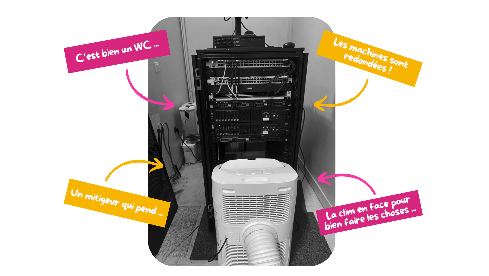
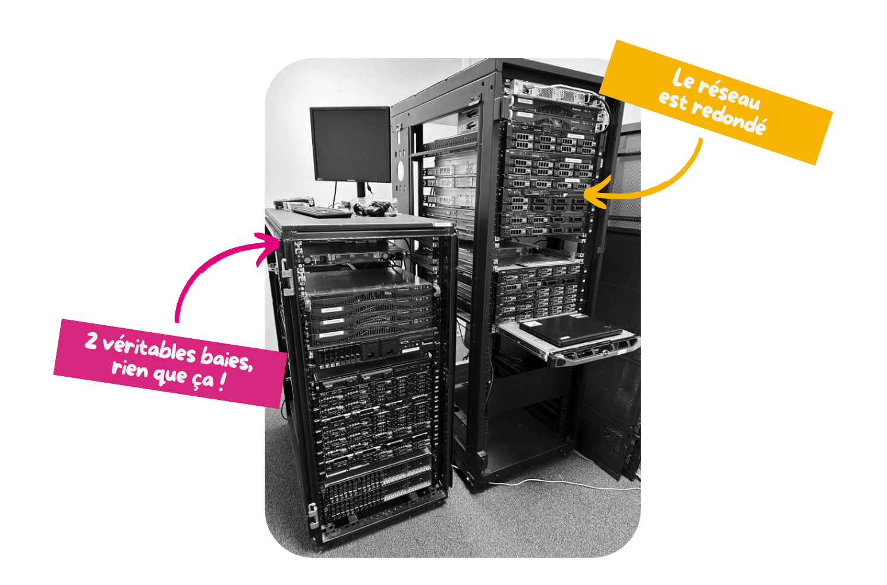
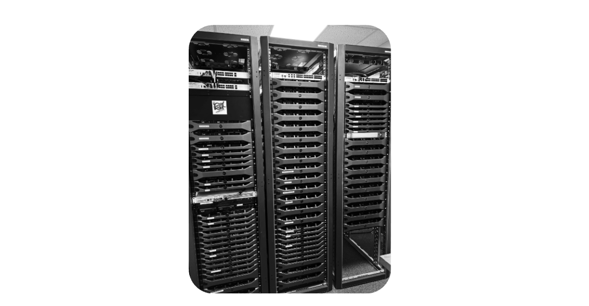

Pour comprendre comment nous en sommes arrivés à créer une plateforme de Cloud dans une association comme les Restos du Coeur, il est important de rappeler l'historique de ce projet.

{}

### Le "pc qui traîne dans un coin"

... et qui était utilisé comme **serveur**.

Dans l'[antenne du 28 (Eure et Loir)](https://www.restosducoeur.org/associations-departementales/les-restos-du-coeur-deure-et-loire/), tout comme dans tout plein d'antennes, celle-ci avait des besoins informatiques divers nécessitant de l'hébergement. Comme la grande majorité, ces services étaient hébergés sur un ordinateur lambda, servant de *serveur*.

Ce PC qui traînait dans un coin possèdait tout un lot de problèmes :

- *Pas de sauvegardes*
- *Aucune redondance*
- *Pas de surveillance*
- *Documentation absente*

### Le "DC aux WC"

Une petite baie a été récupérée ainsi que tout un lot de serveurs anciens. Ces serveurs ont permis de construire la première version du premier datacenter du Cloud du Coeur. Dans le but d'héberger de manière "sécurisée", les services de l'antenne d'Eure et Loir.

C'est aussi ça l'associatif, de la ***débrouille***... C'est d'ailleurs ce qui va définir la continuité du projet tout en ajoutant une grosse par de **professionnalisme**.

### La région Centre-Val de Loire au centre

Rapidement, la mise en place de ces services ont été connus outre les murs de l'antenne du 28, les autres antennes de la région Centre-Val de Loire souhaitées également utiliser ces applications. Ainsi nous avons créé la première version du futur datacenter du **Cloud du Coeur**.

### Trois véritables baies pour nos ADs

L'idée était toujours là, celle de pouvoir héberger tout le monde sans que ça coûte. Nous avons terminé par installer 3 baies de 52 unités de haut pour héberger les serveurs fraîchement récupérés et ainsi proposer l'hébergement à tout le monde.

{}
