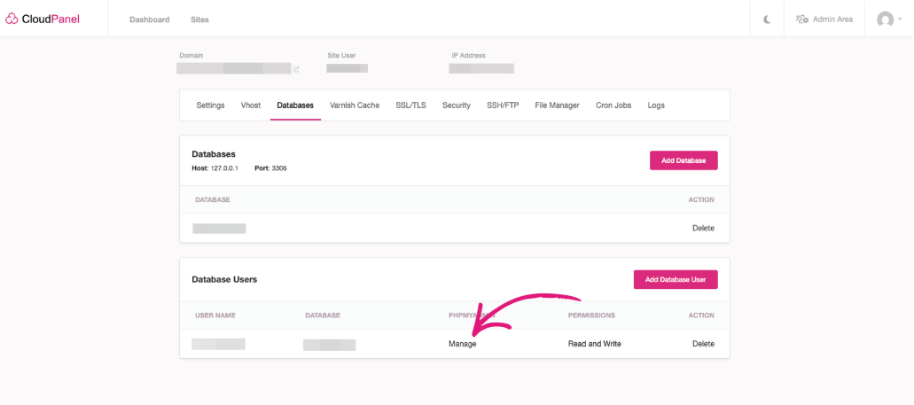
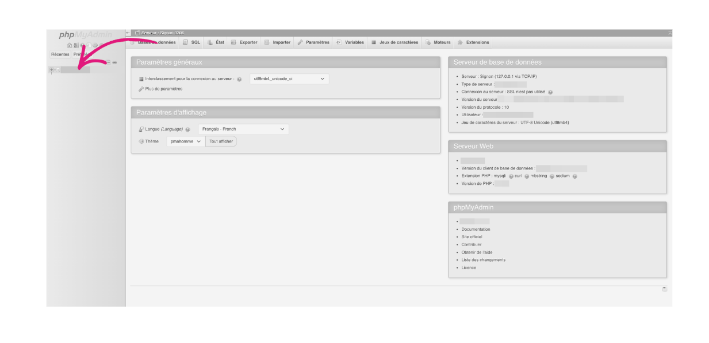
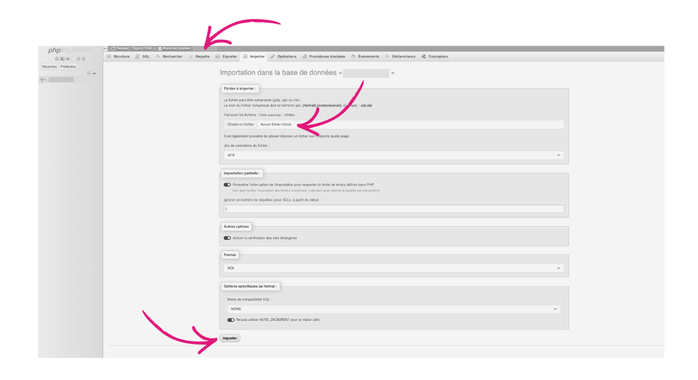

Il vous est possible, sur l'hébergement mutualisé "CloudPanel" d'importer votre base de données existante. Vous devez vous munir du fichier `.sql` de cette dernière.

Une fois ce dernier récupéré, vous pouvez importer votre base via `Phpmyadmin` fournit par **CloudPanel**. Pour accéder à Phpmyadmin, vous devez vous rendre dans l'onglet "Databases" puis dans la section "Database Users", cliquer sur "Manage".

Ensuite dans `Phpmyadmin`, vous devez cliquer sur le nom de votre base de données pour bien la sélectionner, ce denrier est présent à gauche comme précisé ci-dessous :

Une fois la base sélectionnée, son nom apparaîtra dans la bar du haut de la console `Phpmyadmin`.

Ainsi, pour terminer, rendez-vous dans l'onglet "Importer", puis sélectionnez votre fichier à importer.


Il est important de noter que ce fichier ne doit pas excéder **100mo**, dans le cas contraire, veuillez contacter le support du Cloud du Coeur via e-mail (cloudducoeur@restosducoeur.org).


Vous devrez terminer par cliquer sur "Importer".

Voilà, votre base de données est importée. Il faudra bien penser, dans le cas d'une migration, d'adapter au niveau du code applicatif, les identifiants de votre nouvelle base de données créée (si jamais vous n'avez pas réutilisé les précédents identifiants).
