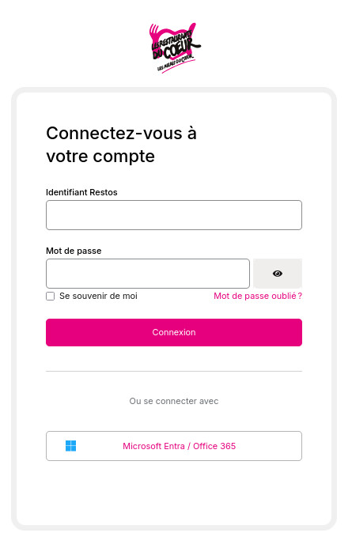
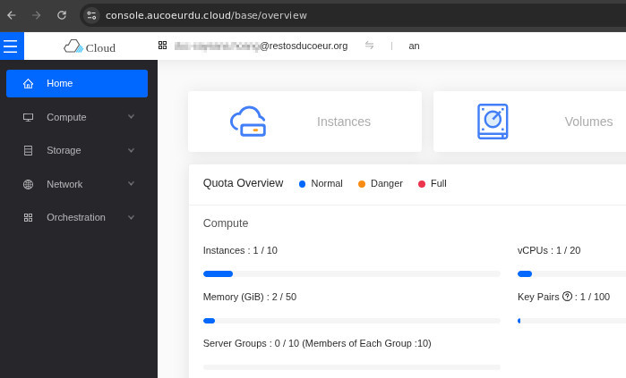

## Prérequis

- Avoir un compte Restos du Coeur

## Connexion à la console

- Ouvrir son navigateur web favori et aller sur [l'adresse de la Console OpenStack Cloud du Coeur](https://console.aucoeurdu.cloud/).
- Une page d'authentification apparaît :

- Entrez votre adresse de courriel Restos du Coeur et votre mot de passe.
- Félicitations, Vous êtes arrivé sur la Console OpenStack :

