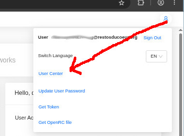
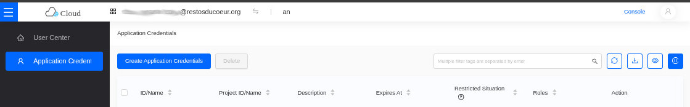
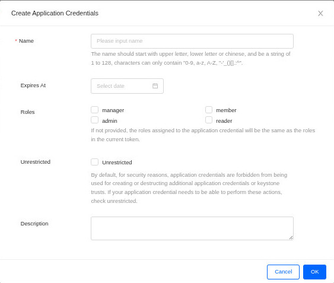
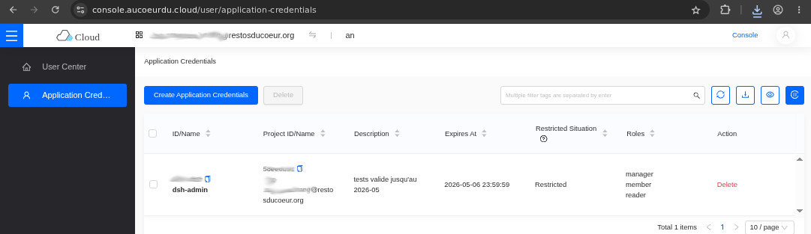

## Prérequis

- Un poste (physique ou virtuel)) sous Linux, MacOS, Windows WSL


## Création de son environnement virtuel OpenStack

### Création d'un venv pour OpenStack

Exécutez les commandes suivantes:

```Shell
python3 -m venv oskclient
source oskclient/bin/activate
pip3 install --upgrade pip
pip3 install --upgrade python-openstackclient
pip3 install --upgrade python-octaviaclient
pip3 install --upgrade python-cinderclient
pip3 install python-designateclient
pip3 install python-heatclient
pip3 install osc-placement
```

Dans la liste des commandes ci-dessus, `oskclient` est le nom du répertoire où résidera votre environnement virtuel.
Vous pouvez utiliser un autre nom.
Il sera créé dans le répertoire courant.

Par la suite, à chaque fois que vous voulez charger votre environnement virtuel dans votre session de commande en ligne (Shell), il faudra l'activer avec la commande `source oskclient/bin/activate`.


### Configuration de l'authentification

Pour que les outils en commandes en lignes puissent s'authentifier auprès d'OpenStack, il faudra créer des variables d'environnement.

Pour un plus grand confort d'utilisation, un script sera utilisé.

Dans l'exemple qui suit, nous allons créer un script qui se trouve sous votre répertoire utilisateur. Bien entendu, vous pouvez le placer ailleurs, il faudra juste ajuster vos chemins.
Vou spouvez aussi changer le nom du fichier de script à votre convenance.

Créez par exemple, le fichier `credoskpar.rc` avec le contenu suivant:

```Shell
#!/usr/bin/env bash
export OS_AUTH_URL=https://osk-api.par.aucoeurdu.cloud:5000/v3/
export OS_APPLICATION_CREDENTIAL_ID=XXXXXXXXXXXXXXXX
export OS_APPLICATION_CREDENTIAL_SECRET=YYYYYYYYYYYYYYY
export OS_INTERFACE=public
export OS_IDENTITY_API_VERSION=3
export OS_AUTH_TYPE=v3applicationcredential
export OS_REGION_NAME=par
```

L'obtention des valeurs des variables d'environnement `OS_APPLICATION_CREDENTIAL_ID` et `OS_APPLICATION_CREDENTIAL_SECRET` est expliqué après.


### Configuration d'un alias sous Bash pour charger l'environnement virtuel

Pour faciliter la vie de l'utilisateur, un alias de commande peut être configuré afin de charger l'environnement virtuel OpenStack, ainsi que les variables d'environnement pour l'authentification.

Pour ce faire rajouter dans le fichier `.bashrc` qui se trouve dans votre répertoire utilisateur le contenu suivant :

```
alias ocp='source ~/oskclient/bin/activate; source ~/credoskpar.rc'
```

Lors des nouvelles sessions Bash/Shell, il suffira de taper la commande (l'alias en fait) :

```
ocp
```

Et c'est tout.


## Obtention des identifiants applicatifs

Cliquez sur l'icône en forme de petit bonhomme en haut à droite, puis
cliquez sur `User Center` :




Une fois sur la page `User Center`; cliquer dans la barre de navigation à gauche
sur `Application Credentials` pour afficher la bonne page :




La boîte de dialogue `Create Application Credentials` apparaît :



Remplisser les informations afin de créer votre identifiant applicatif.

Après la création réussie de l'identiant applicatif, un fichier nommé
d'après la valeur entrée dans le champ `Name` avec l'extension `.json` est
téléchargé automatiquement par le navigateur web.

Ce fichier JSON contient le secret pour s'authentifier à OpenStack et ne
pourra pas être téléchargé à nouveau.


L'identiant apparaît dans la liste des identiants applicatifs :




Voici comment configurer les variables d'environnement d'authentification
avec les information du fichier JSON :

- `OS_APPLICATION_CREDENTIAL_ID` : la valeur correspond au champ `id` dans
  le fichier JSON téléchargé.
- `OS_APPLICATION_CREDENTIAL_SECRET` : correspond à la valeur du champ
  `secret` du fichier JSON téléchargé.


## Vérification que les commandes fonctionnent

Exécutez la commande suivante. Normalement la première fois, cela ne retourne qu'une ligne vide, car le projet OpenStack est vide.

```Shell
openstack server list
```

Si il n'y a pas d'erreurs, c'est que la commande `openstack` fonctionne bien et qu'elle a pu s'authentifier correctement auprès de la plateforme OpenStack du Cloud du Coeur.


## Mode debug avec les commandes OpenStack

Si besoin, vous pouvez activez le mode déboguage en ajouter l'option `--debug` dans vos invocation de la commande `openstack`.

Par example :

```Shell
openstack server list --debug
```

Attention, c'est assez verbeux.


## Ajout de la clé publique SSH pour la connection aux futures VMs

Pour se connecter aux futures VMs, il est préférable d'utiliser votre paire de clés asymétriques SSH.

Ajoutez la clé publique à votre projet avec la commande suivante :

```Shell
openstack keypair create --public-key ~/.ssh/id_ed25519.pub mon_projet_os
```

Changez `mon_projet_os` par le nom de votre projet OpenStack.
Vou spouvez aussi utiliser une paire de clés asymétriques SSH RSA si vous préférez.

Vous devriez avoir une sortie qui ressemble à ce qui suit :

```
+-------------+------------------------------------------------------------------+
| Field       | Value                                                            |
+-------------+------------------------------------------------------------------+
| created_at  | None                                                             |
| fingerprint | d1:a5:1a:b0:35:ac:c5:e8:65:85:3e:88:e4:d2:eb:a5                  |
| id          | mon_projet_os                                                    |
| is_deleted  | None                                                             |
| name        | mon_projet_os                                                    |
| type        | ssh                                                              |
| user_id     | **************************************************************** |
+-------------+------------------------------------------------------------------+
```
