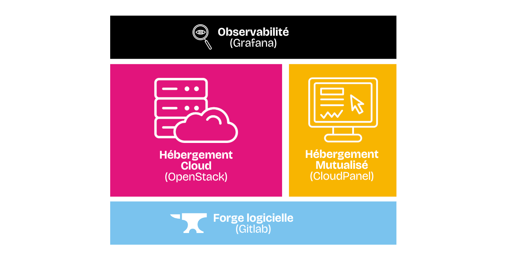

A travers le ***Cloud du Coeur***, nous offrons 2 types d'hébergements :

- **Hébergement mutualisé** : Vous possèdez une console (CloudPanel) et vous êtes autonome sur cette dernière. Idéal pour les petits sites qui n'ont pas vocation à recevoir un très gros trafic.
- **Hébergement Cloud OpenStack** : C'est la [console](https://console.aucoeurdu.cloud) fournie pour que vous puissiez créer et héberger vos applications "at-scale". Que ça soit en la déployant avec une base de données managée ou via un cluster **Kubernetes** tout frais.

Ainsi qu'une plateforme d'**observabilité** commune :

- Une [console unique](https://observabilite.aucoeurdu.cloud/login) permettant d'accéder aux différentes données applicatives avec la possibilité de créer vos propres tableaux de bord.

## Technologies

Suivez étape par étape pour déployer différents types de services déjà documentés et utilisés sur la plateforme.


  
  
  
  
  
  


## Tutoriels

Vous cherchez de l'aide précise sur un sujet, il existe déjà peut-être un tutoriel pour vous aider.

### Hébergement Web mutualisé (CloudPanel)


  
  
  
  
  
  


### Observabilité (Grafana)


  


### Hébergement Cloud (OpenStack)


  
  

