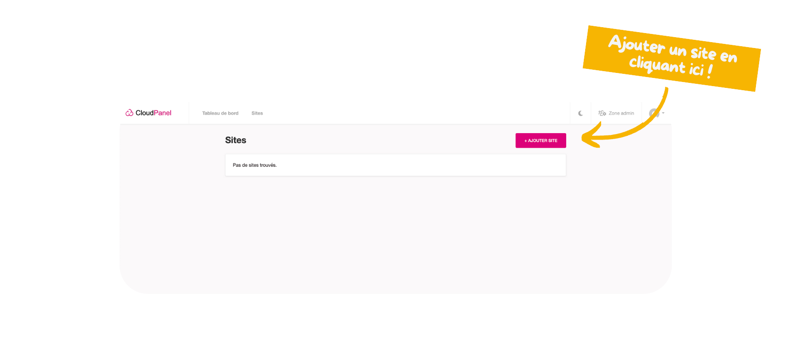
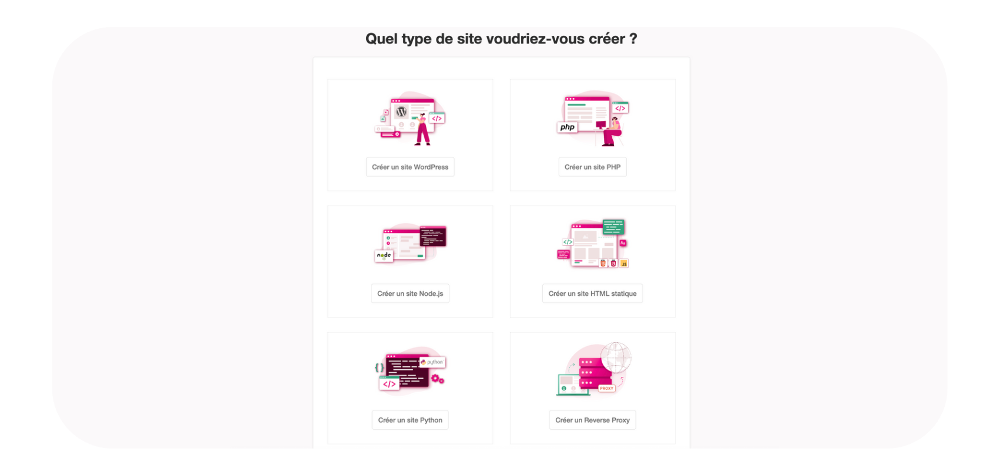
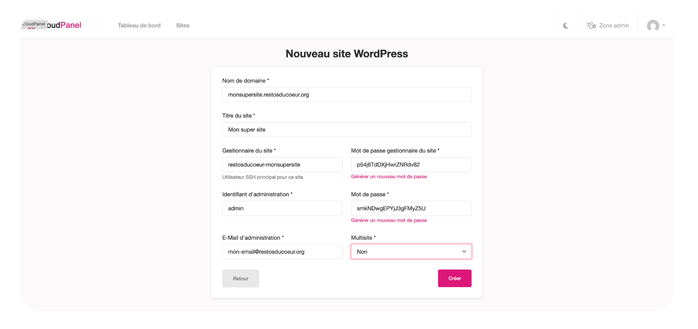

Vous avez accès à la console, super. Maintenant vous allez pouvoir créer votre premier site internet.

Pour ce faire, vous devez cliquer comme suit :

A présent, vous devez sélectionner la technologie que vous allez utiliser pour votre site internet.

Entrez les informations de votre site internet, veuillez bien stocker les mots de passe générés automatiquement par CloudPanel et les stocker dans [Passbolt](https://passbolt.outils.restosducoeur.org/app/passwords).

