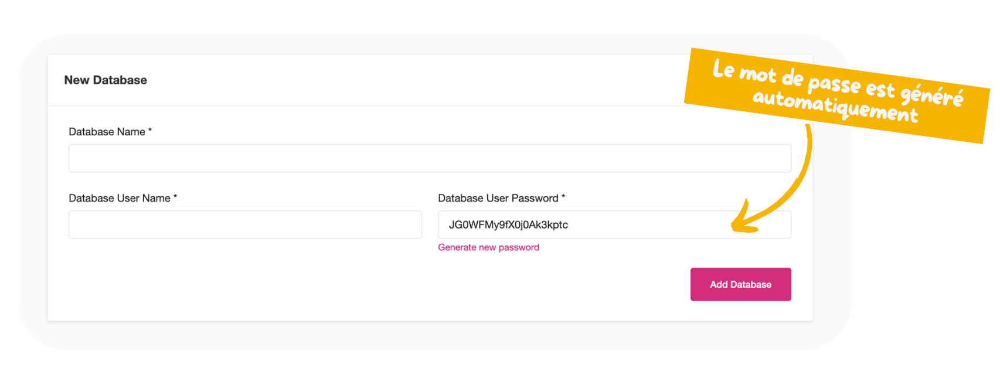

Pour créer une base de donnée (MariaDB/MySQL), il vous suffit de vous rendre sur la configuration de votre site, puis dans la section "database" pour gérer cette dernière.

Une fois que c'est fait, vous pouvez ainsi créer, de manière autonome, autant de base de données que vous le souhaitez.


  A noter que les bases de données ne sont pas présentent sur le même serveur que pour les autres sites hébergés. Chaque site possède son système de base de données qui lui est propre (pour une question d'isolation et de sécurité).

  Au besoin, vous pouvez tout de même appeler une base de donnée externe (notamment une base mise à disposition via la console du **Cloud du Coeur**).


Il ne vous reste plus qu'à créer la base de votre choix avec le nom de base ainsi que le nom d'utilisateur souhaité.

Pensez à bien stocker votre mot de passe de manière sécurisé. En cas de problème, n'hésitez pas à [contacter l'équipe du Cloud du Coeur](/doc/aide/).
