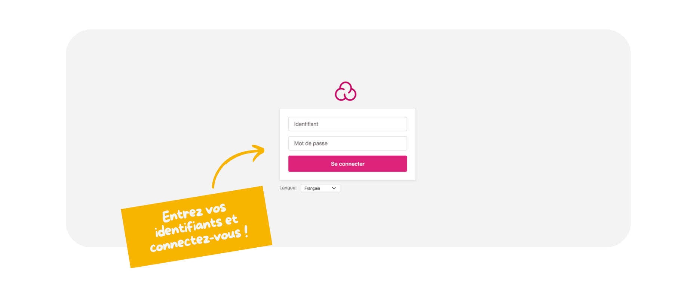

CloudPanel est l'interface mise à disposition des hébergements Web pour les services internes des Restos (dans les antennes). Cette console permet d'administrer, de manière autonome, les sites exposés, les bases de données, l'envoie du code de l'application, etc.

Cette console est mise à disposition par antenne/service (exemple `ad75`). Pour y accéder, vous devez vous connecter sur l'URL mise à disposition et utiliser l'identifiant fournit par l'équipe du Cloud du Coeur. Si vous ne possèdez plus cet identifiant, rendez-vous [ici](/doc/aide/).

L'URL de la console est disponible sous le format :

- [https://console.adXX.rdcnet.org](https://console.adXX.rdcnet.org)

Maintenant, veuillez vous connecter avec votre identifiant fournit et votre mot de passe.


  A noter que chaque console mise à disposition dispose de son tableau de bord de status pour visualiser rapidement l'état de l'ensemble des services qui vous sont mis à disposition.

  Exemple : [https://status.infra.rdcnet.org/status/adXX](https://status.infra.rdcnet.org/status/adXX)

