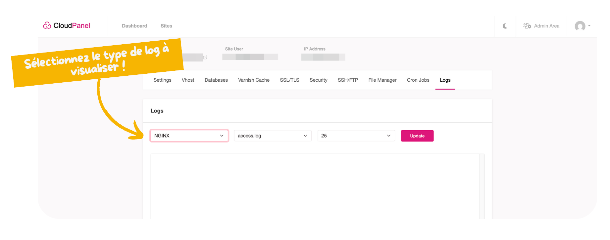

Pour consulter les logs, dans la console de votre site, rendez-vous dans "logs" puis sélectionnez le type de log souhaité.

Par exemple vous avez :

- `nginx` pour le serveur Web qui met à disposition votre site internet.
- `php-fpm` pour le service faisant fonctionner PHP.

N'oubliez pas de cliquer sur **"update"**.

